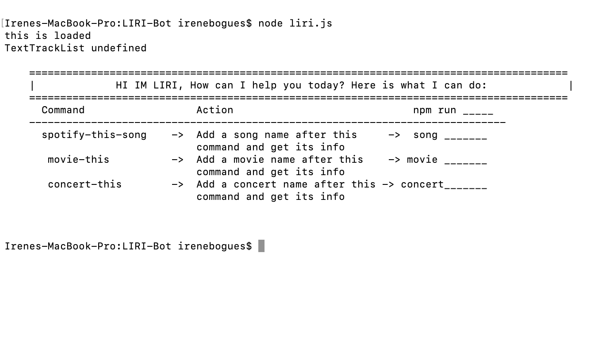
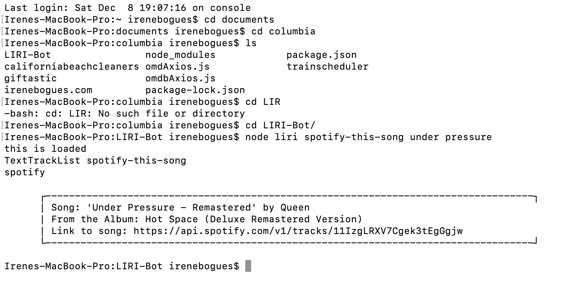

# LIRI-BOT
# Hi! I'm LIRI, you're personal bot. How can I help you today?

# Goal
To create a SIRI-like application that would execute various commands, using Node packages.

# Objectives
* To find, research and implement npm packages.
* To install npm packages and save them to the package.JSON file.

#Installation and Set-Up
# Spotify API keys
SPOTIFY_ID=your-spotify-id
SPOTIFY_SECRET=your-spotify-secret

# Built With
* JavaScript
* NodeJS Packages
* Spotify, OMDB, BandsinTown API's

# Author
* Irene Bogues

# Screenshots

